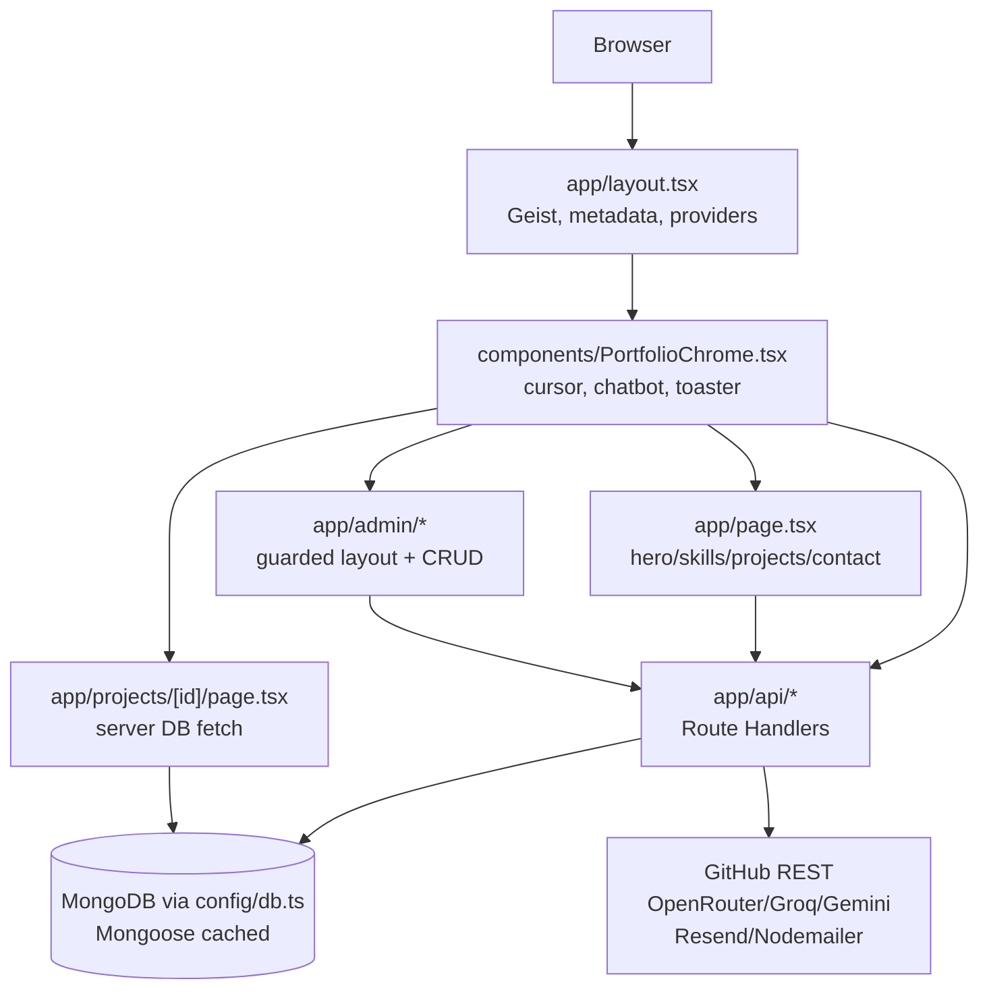
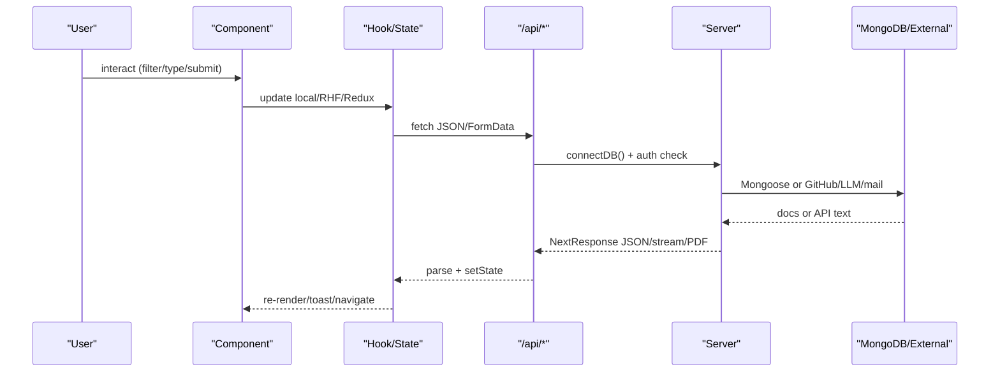
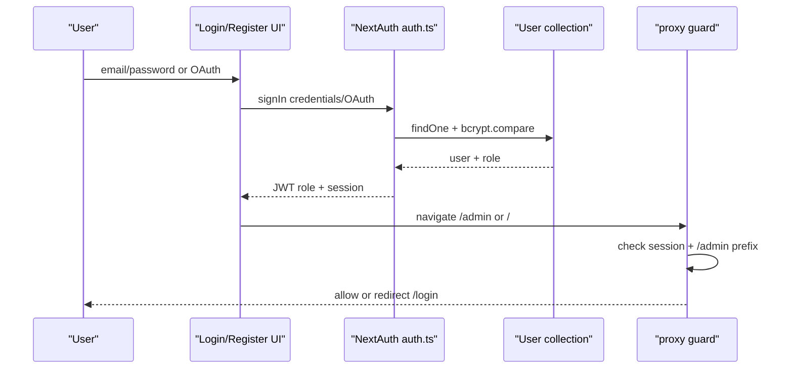
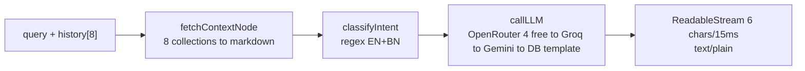
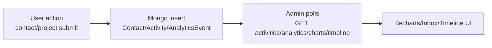

# Soruj Mahmud Portfolio — `my-app`

> Professional Frontend Developer portfolio, CMS, admin dashboard, and AI chatbot.
> Title from `app/layout.tsx`: **Soruj Mahmud | Professional Frontend Developer & UI/UX Specialist**.

## Overview

Full-stack Next.js App Router application (`my-app@0.1.0`, `private:true`):

- Public single-page portfolio (`app/page.tsx`) with Hero, About, Skills, Projects, Experience, Services, GitHub stats, FAQ, Contact.
- Project case-study pages (`app/projects/[id]/page.tsx`), printable resume (`app/resume/*`), user profile (`app/profile/page.tsx`).
- Admin CMS (`app/admin/*`): Dashboard, Analytics, Timeline, Projects/Skills CRUD, Inquiries inbox, Links manager, Settings, Resume.
- Backend: Route Handlers in `app/api/*` on MongoDB via Mongoose (`config/db.ts`), NextAuth v5 (`auth.ts`, `auth.config.ts`, `proxy.ts`), OTP + password-reset, Resend/Nodemailer mail (`lib/mail.ts`).
- AI chatbot “Soruj AI” (`features/chat/*`, `app/api/chat/portfolio/route.ts`) using LangGraph state graph + raw fetch failover to OpenRouter / Groq / Gemini.
- GitHub aggregation (`lib/github/*`, `app/api/github/route.ts`), resume PDF (`@react-pdf/renderer`, `app/api/resume-pdf/route.tsx`), base64 image upload (`app/api/upload/route.ts`).
- No WebSocket/Socket.io/WebRTC. `pusher` + `pusher-js` are declared in `package.json` but have zero imports; live data is Mongo polling.

Configured canonical URL in code: `https://sorujmahmud.com` (`app/layout.tsx:41` `metadataBase`, `openGraph.url`, `alternates.canonical`, `app/sitemap.ts`). `app/robots.ts` only sets `allow:/`, `disallow:/admin/`, and `sitemap` URL. No live demo verified here.

No screenshots in repo. `public/` contains only `file.svg, globe.svg, next.svg, vercel.svg, window.svg, soruj.jpg, Soruj_Mahmud_Resume.pdf`.

## Features

- Hero landing with particle canvas, typing roles, CTA, socials (`features/hero/*`).
- About with bio, stats, animated counters (`features/about/*`).
- Skills showcase by category with 0–100 levels (`features/skills/*`, `GET /api/skills`).
- Projects showcase with category filter, text search, 6-per-page pagination (`features/projects/hooks/usePublicProjects.ts`, `GET /api/projects`).
- Project detail with TOC, reading progress, screenshots, performance, related projects, recently viewed (`app/projects/[id]/page.tsx`, `features/projects/components/ProjectDetailClient.tsx`).
- Experience / Education timelines from Settings (`features/experience/*`).
- Services grid (`features/services/*`, `GET /api/services`).
- GitHub stats (repos, stars, followers, recent commits) (`features/github/components/GitHubStats.tsx`, `GET /api/github`).
- FAQ accordion (`features/faq/*`, `GET /api/faqs`).
- Contact form with Zod validation + admin inbox (`features/contact/*`, `POST /api/contact`).
- Soruj AI chatbot, EN/BN, streaming, history, quick actions, localStorage (`features/chat/*`, `POST /api/chat/portfolio`).
- Resume HTML + print CSS + PDF download, always built live from DB (`app/resume/*`, `GET /api/resume`, `GET /api/resume-pdf`).
- DB-driven links with click tracking + health checks (`hooks/useLinks.ts`, `components/links/*`, `/api/links*`).
- Admin dashboard, analytics (Recharts), timeline (Activity + GitHub), inquiries workflow, projects/skills CRUD with versioning/bulk ops, tabbed Settings CMS, links manager.
- Auth: credentials + Google + GitHub, OTP verification, resend OTP, forget/reset password, profile name edit, first-user admin promotion, `seed:admin` script.

## Tech Stack

Exact names from `package.json`:

- `next@^16.1.1`, `react@^19.2.3`, `react-dom@^19.2.3`, `typescript@^5`, `eslint@^9`, `eslint-config-next@16.1.1`
- `tailwindcss@^4.1.18`, `@tailwindcss/postcss@^4.1.18`, `postcss@^8.5.6`, `tailwindcss-animate@^1.0.7`, `tailwind-merge@^3.4.0`, `clsx@^2.1.1`, `class-variance-authority@^0.7.1`
- `@radix-ui/*` (accordion, dialog, dropdown-menu, select, tabs, tooltip, etc.), `cmdk@^1.1.1`, `vaul@^1.1.2`, `embla-carousel-react@^8.6.0`
- `framer-motion@^12.29.2`, `gsap@^3.13.0`, `lucide-react@^0.554.0`, `next-themes@^0.4.6`, `sonner@^2.0.7`, `sweetalert2@^11.26.21`
- `mongoose@^9.0.2`, `bcryptjs@^3.0.3`, `next-auth@^5.0.0-beta.30`, `zod@4.4.3` (pinned via `overrides`), `react-hook-form@^7.69.0`, `@hookform/resolvers@3.9.1`
- `langchain@^1.5.3`, `@langchain/classic`, `@langchain/community`, `@langchain/core`, `@langchain/deepseek`, `@langchain/google-genai`, `@langchain/groq`, `@langchain/langgraph`, `@langchain/ollama`, `@langchain/openai`, `@google/generative-ai@^0.24.1`, `@modelcontextprotocol/sdk@^1.29.0` — chat path uses raw `fetch`, not these chains
- `pusher@^5.2.0`, `pusher-js@^8.4.0` — declared only, unused
- `resend@^6.6.0`, `nodemailer@^7.0.11`, `react-email@^5.1.0`, `@react-email/components@^1.0.2`
- `@react-pdf/renderer@^4.5.1`, `jspdf@^4.2.0`, `html2canvas@^1.4.1`, `puppeteer-core@^25.1.0`
- `recharts@^2.15.4`, `react-markdown@^10.1.0`, `react-syntax-highlighter@^16.1.1`, `react-quill@^2.0.0`, `date-fns@^4.1.0`, `uuid@^13.0.0`, `crypto@^1.0.1`, `input-otp@^1.4.2`, `react-day-picker@^9.13.0`, `react-resizable-panels@^4.0.13`
- `@reduxjs/toolkit@^2.12.0`, `react-redux@^9.3.0`
- `transpilePackages: ['zod','@langchain/core','@langchain/community','langchain','@hookform/resolvers']` in `next.config.ts`; `.npmrc` contains `legacy-peer-deps=true`.

## Architecture

Hybrid App Router + feature-sliced modules. Home page is client-heavy (`app/page.tsx:1 "use client"` with `ssr:false` sections); admin detail/metadata routes are server-first.



- `app/` holds routing + thin wrappers; `features/<domain>/{components,hooks,lib}` holds domain UI/logic; `components/{layout,providers,shared,ui,seo,links}` holds shell; `lib/services|schemas|github|links|resume|mcp` holds server logic; `models/` holds Mongoose; `actions/portfolio.ts` holds server actions; `store/` holds minimal Redux.
- Styling is Tailwind v4 CSS-first (`app/globals.css` with `@import "tailwindcss"`, `@theme inline`, `@custom-variant dark`); no `tailwind.config.js`. shadcn `new-york/neutral/RSC` per `components.json`.
- Motion split: `framer-motion` for hero/contact/projects/chat micro-interactions; `gsap + ScrollTrigger` for auth/about/experience/services/GitHub/FAQ/nav/footer/loading.

## How It Works

1. `app/layout.tsx` sets SEO metadata, `dark` class, fonts, `JsonLd`, and nests `ReduxProvider > NextAuthProvider > RecentlyViewedProvider > PortfolioChrome`.
2. `/` (`app/page.tsx`, client) shows `LoadingScreen` for 3000ms (`setTimeout(..., 3000)`), then `ParticleBackground + NavBar + HomeSection`, plus 7 rendered lazy sections with `dynamic(ssr:false) + Suspense` (an 8th, `TestimonialsSection`, is defined but commented out).
3. Public sections fetch client-side GETs (`/api/settings`, `/api/projects`, `/api/skills`, `/api/services`, `/api/faqs`, `/api/github`, `/api/portfolio`). `actions/portfolio.ts:getPortfolioData()` is a parallel `lean()` aggregator for RSC/admin use, not used by `app/page.tsx`.
4. Writes go from admin forms via `fetch POST/PUT/PATCH/DELETE` with NextAuth JWT → `requireAdmin()` → Mongoose op → `notify.*` → `Activity` doc → JSON + toast + refetch.
5. Contact: `useContactForm (rhf+zod)` → `POST /api/contact` (server re-validates) → `Contact` + `Activity`.
6. Chat: `useChatState` → `POST /api/chat/portfolio {message, history[-8]}` → LangGraph pipeline → chunked `text/plain` stream → live bubble + `localStorage[portfolioChat]`.
7. Resume: `buildResumeData()` aggregates Settings/Skills/Projects/Certificates live → HTML or `renderToBuffer(<ResumePDFDocument/>)`.
8. Upload: admin `FormData(file)` → `POST /api/upload` → base64 `dataURL` string, stored inline by subsequent CRUD (no S3/Cloudinary write path).

## Application Flow



Concrete: `FeaturedProjectFilters → usePublicProjects → GET /api/projects → connectDB → Project.find → JSON → Grid`; `ContactForm → useContactForm → POST /api/contact → Contact.create + Activity → {success,id} → SuccessAnimation`.

## Authentication



- Config: `auth.config.ts` (edge-safe, empty providers, `jwt.user.role→token.role`, `session.token→session.user`, `pages.signIn:/login`) used by `proxy.ts`; `auth.ts` adds `Google`, `GitHub`, `Credentials{email,password}`.
- Credentials: `connectDB → User.findOne → bcrypt.compare → reject if !isVerified && SKIP_EMAIL_VERIFICATION!=="true"` (throws `Email not verified`). Returns `{id,name,email,role}`.
- OAuth `signIn`: auto-creates missing user (`countDocuments===0 ? admin : user`, random hashed password, `isVerified:true`), attaches DB role, fires non-blocking `notify.systemEvent("Admin Login")`.
- Edge: `proxy.ts` matcher `/((?!api|_next/static|_next/image|favicon.ico).*)`; logged-in `login/register→/`; anon `/admin*→/login`. API routes enforce own checks.
- OTP: `POST /api/register` (hash 12, 6-digit OTP 10m, role `ADMIN_EMAIL` or first-user `admin` else `user`, immediate verified if `SKIP_EMAIL_VERIFICATION` or default admin) → `POST /api/verify-otp` (match+expiry → verified) → `POST /api/resend-otp`.
- Reset: `POST /api/forget-password` (`crypto.randomBytes(32)` hex 1h, generic message anti-enumeration, Resend-only mail) → `POST /api/reset-password {token,password}` (hash, clear).
- Roles: `types/next-auth.d.ts` augments `Session.user.role`, `JWT.role`. `lib/auth/helpers.ts:requireAdmin()` requires `admin`; contact/activities/timeline locally allow `admin|editor`. `app/admin/layout.tsx` server-redirects non-admin to `/login`. `app/api/admin/setup` self-promotes if no admin exists or `secretKey` matches.
- Client: `features/auth/hooks/useLoginForm.ts` (`signIn credentials redirect:false`, toasts, push `/admin`), `useRegisterForm` (two-step), `features/profile/hooks/useProfile.ts` (`useSession` + `PUT /api/user/profile {name}` + `update({name})`).

## API Architecture

Pattern: `connectDB() → [requireAdmin()/auth()] → Mongoose → [notify.* → Activity] → NextResponse.json` with `Cache-Control: public, s-maxage=...` on public GETs.

| Route | Methods |
|---|---|
| `/api/auth/[...nextauth]` | `GET,POST` re-export `handlers` |
| `/api/register`, `/api/verify-otp`, `/api/resend-otp`, `/api/forget-password`, `/api/reset-password` | `POST` public, `User` only |
| `/api/projects` | `GET` public list; `POST` admin create; `PATCH` admin bulk delete/archive/publish/feature/order |
| `/api/projects/[id]` | `GET` public by `_id` or slug; `PUT` admin upsert; `PATCH` admin duplicate/archive/publish/feature/save-version/reorder; `DELETE` admin |
| `/api/skills`, `/api/skills/[id]` | `GET` public; `POST/PUT/DELETE` admin (lookup by ObjectId else title) |
| `/api/blogs`, `/api/blogs/[id]` | `GET` public published; `POST/PUT/DELETE` admin, slug auto-gen |
| `/api/services`, `/api/services/[id]` | `GET` public active; `POST/PUT/DELETE` admin |
| `/api/faqs`, `/api/faqs/[id]` | `GET` public active; `POST/PUT/DELETE` admin |
| `/api/certificates`, `/api/certificates/[id]` | `GET` public active; `POST/PUT/DELETE` admin |
| `/api/contact` | `GET` admin/editor paginated search/status; `POST` public Zod; `PATCH/DELETE` admin/editor single/bulk |
| `/api/settings` | `GET` public (fallback `{}`); `POST` admin overwrite upsert |
| `/api/links`, `/api/links/[id]`, `/api/links/target`, `/api/links/health` | `GET` filtered public; `POST/PUT/PATCH/DELETE` via `lib/links/link-service.ts` validation; click track; HEAD health check |
| `/api/activities` | `GET/POST/PATCH` admin/editor, unread counts |
| `/api/analytics` | `GET` aggregated stats by `?period=7d/30d/90d` |
| `/api/analytics/track` | `POST` public beacon, always `201 {success:true}` |
| `/api/dashboard/charts` | `GET` charts aggregation, no auth check in `app/api/dashboard/charts/route.ts` (verified public) |
| `/api/timeline` | `GET` admin/editor merged Activity + live GitHub |
| `/api/portfolio` | `GET` public `{settings,projects,skills,contactCount}` |
| `/api/resume` | `GET` public JSON via `buildResumeData()` |
| `/api/resume-pdf` | `GET` public PDF buffer via `@react-pdf/renderer` |
| `/api/github` | `GET` public aggregated GitHub, `s-maxage=300` |
| `/api/chat/portfolio` | `GET` public text dump; `POST` public LangGraph + chunked stream |
| `/api/upload` | `POST` admin image→base64 dataURL |
| `/api/health` | `GET` public API+DB+network checks |
| `/api/user/profile` | `PUT` session-only name update |
| `/api/admin/setup` | `GET` HTML / `POST` JSON self-promote if no admin or secret |

Only `POST /api/contact` uses server Zod (`lib/schemas/contact.ts`); links use hand-rolled `validateLinkInput`. Others rely on Mongoose validators.

Example — contact:

```ts
// features/contact/hooks/useContactForm.ts
await fetch("/api/contact", {
  method: "POST",
  headers: { "Content-Type": "application/json" },
  body: JSON.stringify(data), // {name,email,subject,message}
});
// -> { success:true, message:"Message sent successfully!", id } 
// -> { success:false, message:"..." } on 400/500
```

Example — chat streaming (`features/chat/hooks/useChatState.ts` + `app/api/chat/portfolio/route.ts`):

```ts
await fetch("/api/chat/portfolio", {
  method:"POST",
  headers:{ "Content-Type":"application/json" },
  body: JSON.stringify({ message, history: messages.slice(-8) })
});
const reader = res.body?.getReader();
// server enqueues 6 chars / 15ms text/plain, client accumulates
```

Example — upload (`app/api/upload/route.ts`):

```ts
const fd = new FormData(); fd.append("file", file);
await fetch("/api/upload", { method:"POST", body: fd });
// -> { url:"data:image/png;base64,...", name, type, size }
```

## Database

- Connection `config/db.ts:16-59`: global-cached `mongoose.connect(MONGODB_URI, {bufferCommands:false})`, returns `null` with warn during build if missing, throws in dev, SRV hint on `querySrv ECONNREFUSED`. Every handler/action calls `await connectDB()`.
- Collections (`models/*.ts`):

| Model file | Collection | Key fields |
|---|---|---|
| `User.ts` | `users` | `name,email(unique),password,role:admin\|editor\|user,isVerified,otp/otpExpires,resetPasswordToken/Expires,timestamps` + `comparePassword()` |
| `Project.ts` | `projects` | `id(slug unique),title,description,fullDescription,image,technologies[],features[],githubUrl/liveUrl/docs/caseStudy/demoVideo,category(enum 10),status(enum 3),difficulty(enum 4),screenshots/challenges/solutions/tags/lessons/future[],stats{},performance{5×0-100},developmentHighlights[],versions[{snapshot:Mixed}],featured,archived,published,order` |
| `Skill.ts` | `skill_categories` | `title,icon,skills[{name,level 0-100,icon,color,description}]` |
| `Blog.ts` | `blogs` | `title,slug(unique),excerpt,content,coverImage,tags[],category,readTime,published,publishedAt,author,views,order` |
| `Contact.ts` | `contacts` | `name,email,subject,message,status:pending\|read\|replied\|archived,ipAddress,userAgent` |
| `Service.ts` | `services` | `title(unique),description,features[1-10],gradient regex,icon,order,active` |
| `FAQ.ts` | `faqs` | `question,answer,category,order,active` |
| `Certificate.ts` | `certificates` | `title,issuer,date,expiryDate,credentialId/Url,description,skills[],image,order,active` |
| `Link.ts` | `links` | `label,url,type(17 enum),category(social\|project\|contact\|resource\|navigation),icon,isActive,isExternal,openInNewTab,displayOrder,health{status,code,latency},clickCount,lastClickedAt` |
| `Settings.ts` | `settings` | Singleton `strict:false`: `assistant,personal_info,profile,portfolio,seo,social_links,theme,security,notifications,language,data,technical_skills,experience,education(s),experiences,response_guidelines,innovation,expertise,standards,testimonials,case_studies,hero_typing_roles,nav_items,services,faqs` |
| `Resume.ts` | `resumes` | `name,role,location,email,phone,github,portfolio,linkedin,summary[],skills[],projects[],education[],competencies[],softSkills[],languages[]` — read by chatbot, not by resume mapper |
| `AnalyticsEvent.ts` | `analytics_events` | `event:page_view\|project_view\|like\|contact_submit\|github_click,page,projectId,referrer,userAgent,country,device,browser,os` |
| `Activity.ts` | `activities` | `title,description,type:project\|blog\|contact\|security\|system\|analytics\|github\|deployment\|profile,icon,link,read,metadata:Mixed` via `lib/services/notification.ts` |

- Reads use `.lean()` + `JSON.parse(JSON.stringify())` for serialization (`actions/portfolio.ts`). Writes use `create/findByIdAndUpdate(runValidators:true)/updateMany/deleteMany/bulkWrite`.
- `lib/resume/resume-mapper.ts:buildResumeData()` is SSOT for resume (Settings + SkillCategory + Project + Certificate). `lib/services/portfolio-data.ts:getPortfolioData()` and `actions/portfolio.ts:getPortfolioData()` are parallel aggregators for API vs RSC.

## State Management

Minimal global store, otherwise local + server state:

- `store/index.ts:makeStore({ui, portfolio})` via `@reduxjs/toolkit`; `store/slices/uiSlice.ts:{activeSection, isMobileMenuOpen, isScrolled}` + `setActiveSection/toggleMobileMenu/setScrolled`; `store/slices/portfolioSlice.ts:{settings:Record|null, isLoading, selectedProject, projectFilter}` + `setSettings/setLoading/setSelectedProject/setProjectFilter`. Provided by `components/providers/ReduxProvider.tsx` singleton in `app/layout.tsx`.
- `components/providers/RecentlyViewedContext.tsx`: LIFO 5 project IDs for `RecentlyViewedProducts`.
- `components/providers/NextAuthProvider.tsx`: `SessionProvider`; `useSession()` + `update()` for profile name sync (`features/profile/hooks/useProfile.ts`).
- Local `useState/useEffect/useMemo/useRef` per hook (`usePublicProjects`, `usePublicSkills`, `useContactForm`, `useChatState`, `useLinks`, `usePortfolioSettings`); `react-hook-form + zodResolver` for contact/auth/admin forms.
- Route constants in `constants/index.ts`: `LOGIN`, `ROOT`, `PUBLIC_ROUTES`, `ITEMS_PER_PAGE`, `HIDDEN_CHAT_ROUTES=[]`.

## Project Structure

```
app/
  layout.tsx, page.tsx, loading.tsx, global-error.tsx
  login/ register/ forget-password/ reset-password/[token]/ profile/
  projects/[id]/ resume/print/ admin/{page,analytics,timeline,inquiries,settings,resume,links,projects/new|edit/[id],skills/new|edit/[id]}
  api/{auth/[...nextauth],register,verify-otp,resend-otp,forget-password,reset-password,user/profile,admin/setup,
    projects/[id],skills/[id],blogs/[id],services/[id],faqs/[id],certificates/[id],
    contact,settings,links/[id]|target|health,activities,analytics/track,dashboard/charts,timeline,
    portfolio,resume,resume-pdf,github,upload,health,chat/portfolio}
  sitemap.ts, robots.ts, globals.css
features/{about,hero,projects,skills,contact,experience,faq,services,testimonials,profile,auth,admin,chat,github}/
components/{layout,providers,shared,ui,seo,links,PortfolioChrome.tsx,ResumePDFDocument.tsx,ResumeDownloadButton.tsx}
lib/{auth,github,links,mcp,resume,schemas,services,mail.ts,stats.ts,social-utils.ts,particle-engine,resolvers,utils}
models/{User,Project,Skill,Blog,Contact,Service,FAQ,Certificate,Link,Settings,Resume,Activity,AnalyticsEvent}.ts
config/db.ts  actions/portfolio.ts  store/{index.ts,slices/uiSlice.ts,slices/portfolioSlice.ts}
hooks/{useLinks,useNavScroll,useParticleEngine,usePortfolioSettings,useTiltEffect,useLoadingAnimation}.ts
types/{index,admin,dashboard,chat,next-auth.d.ts}  constants/{index,engineering-standards,tech-innovation}.ts
auth.ts  auth.config.ts  proxy.ts  next.config.ts  postcss.config.mjs  components.json  scripts/seed-admin.js
public/{soruj.jpg,Soruj_Mahmud_Resume.pdf,*.svg}
```

Tailwind v4 (no `tailwind.config.js`), shadcn `components.json: new-york/neutral/RSC`, edge guard is `proxy.ts` (Next 16 convention).

## Installation

Dev types target Node 20 (`@types/node@^20` in `devDependencies`); no `engines` field pins the runtime. npm is the lockfile in use (only `package-lock.json` present; `pnpm-lock.yaml`/`yarn.lock` absent). MongoDB URI required.

```bash
git clone <YOUR_REPO_URL>
cd my-app
npm install # respects .npmrc legacy-peer-deps=true
```

## Environment Variables

Never commit values (`.gitignore` ignores `.env*`). Placeholders only. Names found in `.env.local` keys + code refs (`auth.ts`, `admin/setup`, `lib/mail.ts`, `lib/github/config.ts`):

```bash
MONGODB_URI=YOUR_MONGODB_URI
NEXTAUTH_URL=YOUR_NEXTAUTH_URL
NEXTAUTH_SECRET=YOUR_NEXTAUTH_SECRET
AUTH_SECRET=YOUR_AUTH_SECRET
GOOGLE_CLIENT_ID=YOUR_GOOGLE_CLIENT_ID
GOOGLE_CLIENT_SECRET=YOUR_GOOGLE_CLIENT_SECRET
GITHUB_CLIENT_ID=YOUR_GITHUB_CLIENT_ID
GITHUB_CLIENT_SECRET=YOUR_GITHUB_CLIENT_SECRET
GITHUB_TOKEN=YOUR_GITHUB_TOKEN
GITHUB_USERNAME=YOUR_GITHUB_USERNAME
GOOGLE_API_KEY=YOUR_GOOGLE_API_KEY
GROQ_API_KEY=YOUR_GROQ_API_KEY
OPENROUTER_API_KEY=YOUR_OPENROUTER_API_KEY
DEEPSEEK_API_KEY=YOUR_DEEPSEEK_API_KEY
HUGGINGFACE_API_KEY=YOUR_HUGGINGFACE_API_KEY
RESEND_API_KEY=YOUR_RESEND_API_KEY
RESEND_FROM=YOUR_RESEND_FROM
EMAIL_USER=YOUR_EMAIL_USER
EMAIL_PASS=YOUR_EMAIL_PASS
EMAIL_PASSWORD=YOUR_EMAIL_PASSWORD
EMAIL_FROM=YOUR_EMAIL_FROM
EMAIL_SERVER=YOUR_EMAIL_SERVER
ADMIN_EMAIL=YOUR_ADMIN_EMAIL
ADMIN_PASSWORD=YOUR_ADMIN_PASSWORD
NEXT_PUBLIC_APP_URL=YOUR_NEXT_PUBLIC_APP_URL
# Referenced in code, set if needed:
SKIP_EMAIL_VERIFICATION=false
ADMIN_SETUP_KEY=YOUR_ADMIN_SETUP_KEY
# Present but unused write path:
CLOUDINARY_CLOUD_NAME=YOUR_CLOUDINARY_CLOUD_NAME
CLOUDINARY_API_KEY=YOUR_CLOUDINARY_API_KEY
CLOUDINARY_API_SECRET=YOUR_CLOUDINARY_API_SECRET
# Present in some local .env files but unused in code (legacy):
# ACCESS_TOKEN_SECRET, ACCESS_TOKEN_EXPIRY, REFRESH_TOKEN_SECRET, REFRESH_TOKEN_EXPIRY
```

Mail uses `RESEND_API_KEY` first, falls back to Nodemailer Gmail (`EMAIL_USER`/`EMAIL_PASS`). GitHub works without token (60 req/h) but warns to set `GITHUB_TOKEN` for 5000 req/h.

## Running Locally

```bash
# 1. create .env.local per above
# 2. optional seed first admin (parses .env.local, bcrypt 12, upserts users)
npm run seed:admin
# 3. dev
npm run dev
# open http://localhost:3000
```

Login as seeded `ADMIN_EMAIL`, or register → verify OTP → login. OAuth users auto-provision (`count===0 ? admin : user`).

## Available Scripts

Exact from `package.json:5-11`:

| Script | Command |
|---|---|
| `dev` | `next dev` |
| `build` | `next build` |
| `start` | `next start` |
| `lint` | `eslint` |
| `seed:admin` | `node scripts/seed-admin.js` |

## Core Features

- **Projects:** `usePublicProjects` client filter/search/paginate; server detail by `_id` or slug; views tracked via `POST /api/analytics/track {event:project_view}`.
- **Skills/Services/FAQ/Blogs/Certs:** public cached GETs + admin CRUD; forms use `lib/schemas/{skill,project,settings,contact}.ts` client-side, only contact/links re-validate server-side.
- **Contact:** `ContactSection → ContactForm → useContactForm → POST /api/contact → Contact + Activity → admin/inquiries`.
- **GitHub:** `GitHubStats → useGitHubData → GET /api/github → fetchAllGitHubData (9 fetchers, 15s abort, 5m memory cache) → cards`.
- **Links:** `useLinks({category,type}) → GET /api/links → DynamicLink/ValidatedLink`; clicks `POST /api/links/target`; health `POST /api/links/health` (HEAD 10s abort).
- **Resume:** `buildResumeData()` → `GET /api/resume` JSON or `GET /api/resume-pdf` attachment; HTML at `/resume`, print CSS at `/resume/print`, chrome bypass in `PortfolioChrome`.
- **Navigation/SEO:** `NavBar (useNavScroll, IntersectionObserver)`, `Footer (gsap)`, `JsonLd (Person/WebSite/CreativeWork)`, `sitemap [/ ,/projects]`, `robots disallow /admin`, OG/Twitter/canonical in `layout metadata`.

## Admin Features

Guarded by `proxy.ts` + `app/admin/layout.tsx (auth + role!=='admin → redirect /login)`; `AdminShell(SidebarProvider + TopNavigation + ErrorBoundary)`.

- `/admin` (server `force-dynamic`): `getDashboardData()` 13 parallel Mongoose aggregations + GitHub → `DashboardPage (StatsGrid, RecentInquiries, SideWidgets)`.
- `/admin/analytics` (client): period `7d/30d/90d` → `GET /api/analytics` → Recharts interactive charts.
- `/admin/timeline`: `GET /api/timeline` merged `Activity + fetchAllGitHubData → TimelineItem` sorted/deduped/paginated.
- `/admin/inquiries`: `InboxPage/Table/Toolbar/BulkActions/DetailPanel` → `GET/PATCH/DELETE /api/contact` (`ITEMS_PER_PAGE.admin.inquiries:10`).
- `/admin/projects`, `new`, `edit/[id]`: `AdminProjectCard/ProjectForm(BasicFields/MediaLinks/TechMeta)` + `POST/PUT/PATCH/DELETE /api/projects[/[id]]` incl. `duplicate/archive/publish/feature/save-version/reorder` + bulk; images via `/api/upload`.
- `/admin/skills`, `new`, `edit/[id]`: `SkillForm/NodesArray` + `/api/skills*`.
- `/admin/settings`: tabbed `SettingsForm` → `POST /api/settings (overwrite:true)`; `GET` public fallback `{}`.
- `/admin/links`: `LinksManager + LinkForm` → `/api/links*`.
- `/admin/resume`: PDF admin via `@react-pdf/renderer + jspdf + html2canvas`.

## AI Integration

Exists. No vector DB; MongoDB keyword context + LLM failover.



- Graph: `features/chat/lib/portfolioGraph.ts:StateGraph{query,history,context,dbData,intent,response}: fetchContext (Settings,Project,SkillCategory,Blog,Certificate,FAQ,Service,Resume with EN defaults) → classifyIntent (projects|skills|contact|services|faqs|general + BN প্রোজেক্ট/দক্ষতা/সার্ভিস/যোগাযোগ/প্রশ্ন) → generateResponse/callLLM (system prompt strict DB grounding + same-language, history[-8], temp 0.5 max 850)`.
- Providers: `OPENROUTER_API_KEY → google/gemini-2.0-flash-lite-preview-02-05:free, meta-llama/llama-3.3-70b-instruct:free, deepseek/deepseek-r1:free, qwen/qwen-2.5-coder-32b-instruct:free`; `GROQ_API_KEY → llama-3.3-70b-versatile`; `GOOGLE_API_KEY|GEMINI_API_KEY → gemini-1.5-flash`; final DB template with BN detection `[\u0980-\u09FF]`.
- Transport is raw `fetch`, not LangChain chains, despite installed `@langchain/*`. `GET /api/chat/portfolio` returns flattened text (`s-maxage=3600`) for ingestion.
- MCP: `lib/mcp/github-server.ts:createGitHubMcpServer()` exposes 9 tools (`get_github_data|profile|repos|commits|issues|prs|releases|contributors|languages|contribution_graph`) via `@modelcontextprotocol/sdk`; factory only, no Stdio/SSE transport wired.

## Real-Time Communication

No Socket.io/WebSocket/WebRTC. No Pusher wiring despite deps.



- `lib/services/notification.ts:createNotification → Activity.create`; typed `notify.{projectPublished/Updated/Deleted,blogPublished/Updated,messageReceived,securityEvent,deploymentFinished,analyticsMilestone,githubCommit,systemEvent}` called from auth + CRUD.
- `POST /api/analytics/track {event in 5-enum}` UA-parses device/browser/os → `AnalyticsEvent`; `GET /api/analytics` computes visitors (unique UA), sessions (30m gap), live (5m distinct), devices/browsers/countries/referrals, weekly/hourly, topProjects.
- Refresh = refetch; no push.

## Security

Implemented:

- Edge redirect + server layout role check + per-handler `requireAdmin()` (401 on fail); `matcher` excludes `api` so handlers must check.
- `bcryptjs.hash(12)`, OTP 10m, reset token 1h, `isVerified` gate, generic forget message, OAuth verified by provider.
- Server `contactFormSchema.safeParse` (400 joined), `validateLinkInput` blocks `javascript:/data:`, normalizes `http→https`, upload allowlist `jpeg/png/webp/gif/svg` ≤10MB, `isValidObjectId` dual lookup.
- `next.config.ts:images.remotePatterns(res.cloudinary,unsplash,ibb,gstatic)+dangerouslyAllowSVG+CSP sandbox`.

Known gaps (do not rely on absence):

- Links mutating routes lack `requireAdmin` (UI guard only).
- `GET /api/analytics` has no auth check (verified in `app/api/analytics/route.ts`); `GET /api/dashboard/charts` has no auth check (verified in `app/api/dashboard/charts/route.ts`).
- `admin/setup` default secret fallback + first-OAuth-user admin race.
- No rate-limit on OTP/contact/track/chat/upload.

## Error Handling

- `app/global-error.tsx` (client full-html fallback + `reset()`), `app/loading.tsx` + `app/admin/loading.tsx` skeletons, per-section `Suspense`.
- Routes return `400` (validation/JSON/shape), `401` (unauthorized), `500` (DB/save) with `{error|success,message}`; contact splits DB vs save errors; `track` always `201 {success:true}` even on error; chat `POST` catch returns static fallback `200 text/plain`.
- Client: `rhf` field errors, `submitStatus` inline (contact), `sonner` toasts (auth/profile/chat/admin), `EmptyState` + `ErrorBoundary` in admin, image fallbacks, `[]` fallback on fetch fail.
- Observability: `console.error` in handlers, `next-dev.log`, `notify.systemEvent` for logins/settings.

## Performance

- Home is client + `ssr:false` lazy sections + forced 3s loader — fast TTFB tradeoff for animation richness; consider server streaming if SEO-critical.
- Public GETs cached (`portfolio 60s, blogs/services/faqs/certs/github 300s, chat dump 3600s`); chat does 8 full-collection reads per message (no pagination/vector); PDF rebuilt live per request; timeline does 9 GitHub calls per request (5m memory cache, cold-start loss).
- Base64 uploads inflate Mongo docs (16MB limit risk) and payloads; prefer CDN (Cloudinary keys present but unused).
- Bundle: `Geist` fonts, `framer-motion + gsap`, `recharts`, `react-quill`, `react-syntax-highlighter` are heavy; admin charts/quill load only in admin.

## Deployment

Standard Next.js only. No `Dockerfile`, `docker-compose`, or `vercel.json` in repo.

```bash
npm run build # next build, DB null-safe during phase-production-build
npm run start # next start, needs .env.local + Mongo reachable + NEXTAUTH_URL set
npm run lint  # eslint
```

Set `MONGODB_URI`, `NEXTAUTH_URL/SECRET`, OAuth IDs/secrets, mail keys, LLM keys, `ADMIN_EMAIL/PASSWORD` for seed. `metadataBase https://sorujmahmud.com` assumes that domain for OG/canonical/sitemap.

## Troubleshooting

- `Please define MONGODB_URI` → set in `.env.local`; `querySrv ECONNREFUSED` → switch `mongodb+srv://` to `mongodb://` per `config/db.ts:51-53`.
- `MONGODB_URI is not defined. Skipping` during build → normal if no DB query at build; ensure runtime env set.
- GitHub `Rate limited 403/429` or empty stats → set `GITHUB_TOKEN` (60→5000 req/h) per `lib/github/client.ts:17-29`; 15s timeout returns `null` → skeleton.
- `Email not verified` on login → check OTP mail (Resend first, Nodemailer Gmail fallback via `EMAIL_USER`/`EMAIL_PASS`; hardcoded fallback sender in `lib/mail.ts:110` — do not publish it); if `No email service` → set `RESEND_API_KEY` or `EMAIL_USER/PASS`; dev bypass `SKIP_EMAIL_VERIFICATION=true` only locally.
- OTP invalid/expired → `POST /api/resend-otp`; reset invalid/expired → re-request `POST /api/forget-password`.
- Upload `Invalid file type / File too large` → use JPEG/PNG/WebP/GIF/SVG ≤10MB.
- Admin redirect loop → verify session role is `admin` (`User.role`), `proxy.ts PUBLIC_ROUTES`, `app/admin/layout.tsx` check.

## Future Improvements

Suggestions from debt found, not roadmap promises:

- Add `requireAdmin` to links, gate analytics/charts, remove default setup secret, seed admin only via `seed:admin`, fix first-OAuth admin race.
- Rate-limit `register/verify/resend/contact/track/chat/upload` + captcha.
- Move upload to Cloudinary/S3 (keys already in env) and migrate dataURLs.
- Cache chat context (60s ISR), limit fields, add Atlas Vector search, log per-IP tokens; remove or use unused LangChain/MCP/Pusher/react-quill deps.
- TTL/cap `AnalyticsEvent/Activity`, cap `Project.versions[]`, `Settings PATCH` merge vs `overwrite:true`, `pre(save)` password hook, add missing `Contact.reply` or remove from types.
- Server-render home with streaming, `stale-while-revalidate`, paginate timeline/GitHub, lazy-load heavy libs, fix `PUBLIC_ROUTES` for `/projects/*,/resume`.

## Contributing

No `CONTRIBUTING.md` or commit convention in repo. Standard flow:

```bash
git checkout -b feat/<name>
npm run lint
# open PR with scope + test notes (manual: dev/build/start + touched routes)
```

Do not commit `.env*`, base64 fixtures, or generated `.next/`. Only `package-lock.json` is used (no pnpm/yarn).

## License

No `LICENSE*` file found in repo. Default all-rights-reserved. Add `LICENSE` (e.g., MIT) to open-source.
